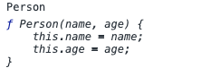
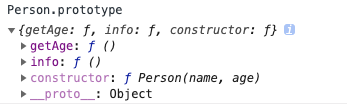
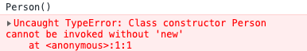

### 3.7 ES6 中的 class
在 JavaScript 中，class 实际上是一种“语法糖”，我们可以使用 class 去干净整洁地定义基于原型的类。
#### 3.7.1 class 使用
##### 3.7.1.1 基于原型实现类
```javascript
function Person(name, age) {
    this.name = name;
    this.age = age;
}
Person.prototype._getAge = function() {
    return this.age + 10;
}

Person.prototype.outputInfo = function() {
    console.log('name：', this.name, 'currentAge: ', this._getAge())
}
let jane = new Person('jane', 14);
jane.outputInfo()     //name： jane currentAge:  24
```

#### 3.7.1.2 基于 class 实现相同的类
```javascript
class Person {
    constructor(name, age) {
        this.name = name;
        this.age = age;
    }
    getAge () {
        return this.age + 10;
    }
    outputInfo () {
        console.log('name：', this.name, 'currentAge: ', this.getAge())
    }
}
let jane = new Person('jane', 14);
jane.outputInfo()     //name： jane currentAge:  24
```

#### 3.7.2 class 完成了如下过程：
* 声明了 `Person` 变量，且将它的值指向 `constructor` 函数，如下图：



* 所有类中定义的方法挂到了 `Person.prototype` 上，如下图：



#### 3.7.3 class 特点：
* 必须与 `new` 一同使用，如下图：



* class 拥有一个默认的 `constructor(){}` ，
class 中没有定义 `constructor` 的话，会默认生成一个空的构造函数：`constructor(){}`。

* class 中的方法都是不可枚举的
这样遍历新建的对象时，类上的方法不会被遍历。

* class 中只能定义方法

```javascript
class Person {
    constructor(name, age) {
        this.name = name;
        this.age = age;
    }
    subName: 'jane'//只能定义方法
}
//Uncaught SyntaxError: Unexpected identifier
//如果一定要添加可在原型链上添加或通过 getter 添加
```

#### 3.7.4 静态方法

新增在 class 上而非新增在 `prototype` 上的方法，称为静态方法。

##### 3.7.4.1 定义静态方法

```javascript
class Person {
    static sum(a, b){
        console.log(a+b)
    }
}
```

##### 3.7.4.2 静态方法调用

**静态方法需直接通过该类来调用，无需实例化，实例化调用会报错**

```javascript
class Person {
    static sum(a, b){
        console.log(a+b)
    }
}
Person.sum(1, 2);//3
let person = new Person();
person.sum(1, 2);//报错：Uncaught TypeError: person.sum is not a function
```

#### 3.7.5 类继承

##### 3.7.5.1 类继承的实现

假设现在有两个类：Person 和 Student

```javascript
class Person {
    constructor(name, age) {
        this.name = name;
        this.age = age;
    }
    getAge () {
        return this.age + 10;
    }
    outputInfo () {
        console.log('name：', this.name, 'currentAge: ', this.getAge())
    }
}

class Student {
    constructor(name, age) {
        this.name = name;
        this.age = age;
    }
    getAge () {
        return this.age + 10;
    }
    outputInfo () {
        console.log('name：', this.name, 'currentAge: ', this.getAge())
    }
    startStudy () {
        alert(`我是${this.name}, 我要学习啦！`)
    }
}
let student = new Student('jane', 12)
student.startStudy()
```

如上，两个类是独立的，但其实 Student 是属于 Person 的，Person 中的方法 Student 中都有，且可以自己进行拓展，所以我们可以使用 “extends”  让 Student 来“继承” Person：

```javascript
class Person {
    constructor(name, age) {
        this.name = name;
        this.age = age;
    }
    getAge () {
        return this.age + 10;
    }
    outputInfo () {
        console.log('name：', this.name, 'currentAge: ', this.getAge())
    }
}

class Student extends Person {
    startStudy () {
        alert(`我是${this.name}, 我要学习啦！`)
    }
}
let student = new Student('jane', 12)
student.startStudy()
```

如上，便实现了 Student 对 Person 的继承，如果在 Student.prototype 中没有找到某个方法，就会从 Person.prototype 中继续寻找。

##### 3.7.5.2 super 的作用

**1. 重写构造函数 —— 继承父类参数**

当子类有构造函数时，必须调用 super 方法来继承父类的参数。

```javascript
class Person {
    constructor(name, age) {
        this.name = name;
        this.age = age;
    }
    getAge () {
        return this.age + 10;
    }
    outputInfo () {
        console.log('name：', this.name, 'currentAge: ', this.getAge())
    }
}

class Student extends Person {
    constructor(name, age) {
        super(name, age); //继承父类参数，必须写在构造函数最前面
        this.studyStatus = false;   //必须写在 super() 之后，否则报错
    }

    startStudy () {
        super.outputInfo()
        alert(`我是${this.name}, 我要学习啦！`)
    }
}
let student = new Student('jane', 12)
student.startStudy()
```

**2. 调用父类的方法 —— super.fun()**

```javascript
class Person {
    constructor(name, age) {
        this.name = name;
        this.age = age;
    }
    getAge () {
        return this.age + 10;
    }
    outputInfo () {
        console.log('name：', this.name, 'currentAge: ', this.getAge())
    }
}

class Student extends Person {
    constructor(name, age) {
        super(name, age); //继承父类参数，必须写在构造函数最前面
        this.studyStatus = false;   //必须写在 super() 之后，否则报错
    }

    startStudy () {
        super.outputInfo()  //会执行父类的这个方法
        alert(`我是${this.name}, 我要学习啦！`)
    }
}
let student = new Student('jane', 12)
student.startStudy()
```

> 箭头函数没有自己的 super，它们的 super 即是就近的上下文的 super，同它的 this 一样。

##### 3.7.5.3 重写父类方法

```javascript
class Person {
    constructor(name, age) {
        this.name = name;
        this.age = age;
    }
    getAge () {
        return this.age + 10;
    }
    outputInfo () {
        console.log('name：', this.name, 'currentAge: ', this.getAge())
    }
}

class Student extends Person {
    constructor(name, age) {
        super(name, age); //继承父类参数，必须写在构造函数最前面
        this.studyStatus = false;   //必须写在 super() 之后，否则报错
    }
    outputInfo () {
        alert(`name： ${this.name}, currentAge:  ${this.getAge()}`)
    }
}
let student = new Student('jane', 12)
student.outputInfo()
```
如上，子类中有与父类相同的方法，会直接覆盖父类的方法，因为执行时，会现在 Student.prototype 中寻找这个方法，没有找到时，才会从 Person.prototype 中继续寻找。